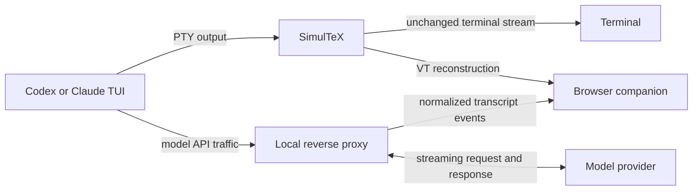

<p align="center">
  
</p>

# SimulTeX

**A browser companion for Codex CLI and Claude Code.**

SimulTeX preserves the native terminal UI while turning the conversation into a
readable, scrollable browser transcript. Prompts and responses render as rich
Markdown; terminal chrome, composers, status indicators, tool activity, and
permission panels remain recognizable alongside them.

The browser is read-only. You continue working in the real Codex or Claude
terminal session while SimulTeX mirrors it on a private localhost URL.

Compared with artifact-style workflows that ask the agent to create and format
an HTML file, SimulTeX keeps presentation out of the generation task. The agent
can answer directly in Markdown and devote its attention and context to the
content instead of simultaneously designing markup, CSS, and layout. SimulTeX
then renders that same output immediately with a fast, deterministic processor,
producing a consistently polished result without making the model act as the
document renderer.

## Quick start

SimulTeX requires Python 3.10 or newer. From this repository:

```sh
python3 -m pip install -e .
simultex -- codex
```

Claude Code works the same way:

```sh
simultex -- claude
```

Copy or open the token-bearing URL printed by SimulTeX, then press Enter to
launch the child session. Keyboard input stays in the terminal; the browser
follows the session live.

Resume an existing Codex conversation with its exact saved Markdown:

```sh
simultex -- codex resume SESSION_ID
simultex -- codex resume --last
```

SimulTeX reads the matching local Codex rollout when an explicit UUID or
`--last` selects the session. If that saved history is unavailable or uses an
unknown format, startup continues with the PTY-derived transcript.

## What you get

- The original Codex or Claude TUI, unchanged in your terminal
- Exact user Markdown and assistant output for direct Codex and Claude sessions
- Terminal composers, startup UI, tool/status output, and permission prompts
- KaTeX math, including inline and display equations
- Mermaid diagrams from fenced `mermaid` blocks
- Syntax highlighting for explicitly labeled code fences
- Markdown tables, lists, blockquotes, links, and images
- Click-to-copy regions for inline code, fenced code, `latex`/`tex` fences, and
  Mermaid source
- Static, self-contained HTML transcript downloads
- PTY-only fallback for other interactive terminal programs

## How it works



SimulTeX launches the child in a genuine controlling pseudo-terminal and forwards
keystrokes, output, signals, exit status, and window size normally. The same PTY
output is mirrored into an in-memory VT screen so the browser can reconstruct
terminal UI without replacing or modifying the original TUI.

For direct `codex` and `claude` commands, SimulTeX also starts a temporary
loopback reverse proxy. Only the child receives the per-run API routing override.
The proxy forwards model traffic as it arrives and normalizes provider responses
into turn, call, user-message, and assistant-text events.

Those API events are authoritative for conversation content, preserving exact
Markdown and TeX without the loss caused by terminal wrapping. PTY reconstruction
supplies everything the API does not contain: startup chrome, composers, status
UI, tool activity, permission panels, and fallback messages. Calls triggered by
tools remain grouped in their original turn.

If API content is unavailable or a call fails before producing text, the
PTY-derived block remains visible instead of disappearing.

## Browser features

### Rich Markdown

Submitted prompts and assistant responses render with `markdown-it`. SimulTeX
supports KaTeX equations, Mermaid architecture diagrams, tables, images, and a
curated set of Highlight.js languages. Unknown and unlabeled code fences remain
safely escaped plain code.

Local Markdown image paths are served through the token-protected companion;
HTTP and HTTPS image URLs load normally. Local paths are constrained to the
session's working directory.

### Exact-source copying

Inline code, fenced code, rendered `latex`/`tex` fences, and Mermaid diagrams
are clickable copy regions. Copying uses the original Markdown source rather
than reconstructed or rendered text. The interaction also works in downloaded
HTML through a local-file clipboard fallback.

### Self-contained exports

Use **Download HTML** in the browser header to save the current transcript. The
export embeds its CSS, fonts, rendered Mermaid SVGs, and loaded local images. It
removes the live event connection and access token while retaining the original
Markdown and diagnostic metadata needed to inspect transcript reconciliation.

Remote images are embedded when the browser can fetch them; otherwise their
original URL remains in the snapshot.

## Options

Use a fixed port when helpful for browser automation:

```sh
simultex --browser-port 8765 -- codex
```

Disable authoritative API capture to test PTY reconstruction by itself:

```sh
simultex --no-api-proxy -- codex
```

Useful development and diagnostic options:

```sh
simultex --api-upstream URL -- codex
simultex --capture-raw codex.raw -- codex
simultex --no-dollar -- codex
```

Raw captures can contain the complete terminal conversation and metadata.
SimulTeX refuses to overwrite an existing capture file.

## Privacy and security

The companion server and model proxy bind only to `127.0.0.1`. The live page
and event stream require a random token included in the printed URL. Keep that
URL private: anyone who can open it can read the mirrored conversation.

The browser is deliberately read-only and cannot send input to the child. API
routing changes are scoped to the launched child process; SimulTeX does not modify
global Codex or Claude configuration. Browser mode sends no graphics escapes or
other modified output to the terminal.

When resuming Codex by UUID or with `--last`, SimulTeX reads that conversation's
local saved rollout to recover Markdown that the restored terminal UI no longer
contains. The data stays in the same loopback-only browser event stream.

Remote Markdown images can contact their referenced HTTP servers when the page
loads. Downloaded transcripts may contain conversation text, API reconciliation
metadata, and embedded local images; review them before sharing.

## Limitations

The browser companion is a rich transcript, not a pixel-perfect second terminal.
Conversation content is rendered as Markdown, while non-message output remains
fixed-width terminal HTML. The active composer is reconstructed from transient
terminal state and may briefly change as the TUI repaints.

Authoritative API transcripts are currently available for direct Codex CLI and
Claude Code launches. Other commands still receive the PTY-backed browser view,
but Markdown that the child removed before drawing the terminal cannot be
recovered exactly.

## Development

```sh
PYTHONPATH=src python3 -m unittest discover -s tests -v
cd browser-ui && npm install && npm test && npm run build
PYTHONPATH=src python3 scripts/replay_capture.py /path/to/codex.raw
```

The Python suite covers the PTY proxy, browser server, API normalization,
provider routing, terminal reconstruction, image security, and optional terminal
rendering. The browser suite covers message reconciliation, composer state,
Markdown features, copy behavior, exports, Mermaid, syntax highlighting, and
image source handling.

## License

MIT
