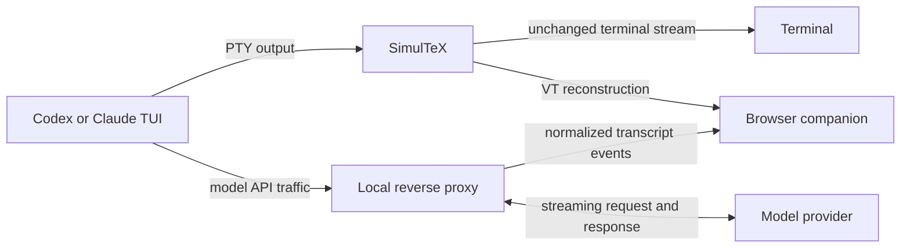

<p align="center">
  
</p>

# SimulTeX

**A rich browser companion for Codex and Claude Code CLI.**

SimulTeX preserves the native terminal UI while turning the conversation into a
readable, scrollable browser transcript. Prompts and responses render as rich
Markdown.

The browser is read-only. You continue working in the real Codex or Claude
terminal session while SimulTeX mirrors it on a private localhost URL.

## Quick start

SimulTeX requires Python 3.10 or newer. Install it with pipx (recommended for a
CLI application):

```sh
pipx install simultex
```

Or install it into your current Python environment:

```sh
python3 -m pip install simultex
```

Both methods reject unsupported Python versions. If pipx selects an older
interpreter, choose one explicitly:

```sh
pipx install --python python3.11 simultex
```

Launch Codex or Claude Code through SimulTeX:

```sh
simultex -- codex
simultex -- claude
```

Copy or open the token-bearing URL printed by SimulTeX, then press Enter to
launch the child session. Keyboard input stays in the terminal; the browser
follows the session live.

Resume an existing Codex or Claude conversation with its exact saved Markdown:

```sh
simultex -- codex resume SESSION_ID
simultex -- claude --resume SESSION_ID
```

SimulTeX reads the matching local Codex rollout when an explicit UUID or
`--last` selects the session. If that saved history is unavailable or uses an
unknown format, startup continues with the PTY-derived transcript.

## What you get

- The original Codex or Claude TUI, unchanged in your terminal
- Exact user Markdown and assistant output for direct Codex and Claude sessions
- Terminal composers, startup UI, tool/status output, and permission prompts
- KaTeX math, including inline and display equations
- Mermaid diagrams from fenced `mermaid` blocks
- Syntax highlighting for explicitly labeled code fences
- Markdown tables, lists, blockquotes, links, and images
- Click-to-copy regions for inline code, fenced code, `latex`/`tex` fences, and
  Mermaid source
- Static, self-contained HTML transcript downloads
- PTY-only fallback for other interactive terminal programs

## Why SimulTeX?

- **Works with Codex and Claude.** Use the same browser experience with
  Codex CLI or Claude Code while continuing to work in their native TUIs.
- **Rich rendering for user/assistant messages.** Both user messages and assistant responses
  support Markdown, LaTeX, images, Mermaid diagrams, highlighted code, tables,
  and more.
- **Search like a web page.** Search the entire conversation with
  <kbd>Ctrl</kbd>/<kbd>Cmd</kbd>+<kbd>F</kbd>, scroll freely, and select or copy
  content without fighting terminal history.
- **Share a live view.** Let students or collaborators follow the conversation
  as it happens through screen sharing or a secure localhost tunnel.
- **Let the agent focus on the answer.** The agent answers in Markdown;
  SimulTeX handles consistent rendering without asking it to author and style an
  HTML artifact.
- **Customize the presentation.** Because the companion is built with HTML and
  CSS, you can adapt its layout and styling without changing how the agent
  responds.
- **Export as HTML.** Download the current conversation as a
  self-contained HTML file directly from the companion page.
- **Keep control in the terminal.** The companion is read-only, so
  input, permissions, and interactive controls stay in the real terminal.

## How it works



SimulTeX launches the child in a genuine controlling pseudo-terminal and forwards
keystrokes, output, signals, exit status, and window size normally. The same PTY
output is mirrored into an in-memory VT screen so the browser can reconstruct
terminal UI without replacing or modifying the original TUI.

For direct `codex` and `claude` commands, SimulTeX also starts a temporary
loopback reverse proxy. Only the child receives the per-run API routing override.
The proxy forwards model traffic as it arrives and normalizes provider responses
into turn, call, user-message, and assistant-text events.

Those API events are authoritative for conversation content, preserving exact
Markdown and TeX without the loss caused by terminal wrapping. PTY reconstruction
supplies everything the API does not contain: startup chrome, composers, status
UI, tool activity, permission panels, and fallback messages.

If API content is unavailable or a call fails before producing text, the
PTY-derived block remains visible instead of disappearing.

## Options

Use a fixed port when helpful for browser automation:

```sh
simultex --browser-port 8765 -- codex
```

Disable authoritative API capture to test PTY reconstruction by itself:

```sh
simultex --no-api-proxy -- codex
```

Useful development and diagnostic options:

```sh
simultex --api-upstream URL -- codex
simultex --capture-raw codex.raw -- codex
simultex --no-dollar -- codex
```

Raw captures can contain the complete terminal conversation and metadata.
SimulTeX refuses to overwrite an existing capture file.

## Exporting and sharing

Use **Download HTML** to save a self-contained transcript with its styles, fonts,
rendered diagrams, and loaded local images. The export removes the live connection
and access token.

Copyable code, LaTeX, and Mermaid regions preserve their original source in both
the live companion and downloaded HTML. Remote images are embedded when possible;
otherwise their original URLs remain in the file.

## Privacy and security

- **Local and private by default.** SimulTeX listens only on `127.0.0.1`, and the
  live transcript requires the random token in the printed URL. Share it only
  with people you trust and only through a secure tunnel.
- **Read-only companion.** The browser cannot control the child process, and API
  routing changes apply only to the launched command—not your global Codex or
  Claude configuration.
- **Local history access.** When resuming Codex, SimulTeX may read its saved local
  history to restore exact Markdown; that data remains on the local companion.
- **Review before sharing.** Remote images contact their original servers, and
  downloaded transcripts may include conversation text, metadata, and local
  images.

## Limitations

- SimulTeX is a readable transcript, not a pixel-perfect copy of the terminal.
  Messages render as Markdown, while terminal UI stays fixed-width; the composer
  may briefly flicker during redraws.
- Direct Codex and Claude sessions provide the most accurate Markdown. Other
  commands rely on terminal reconstruction, so content erased before it appears
  cannot always be recovered.

## Development

```sh
python3 -m pip install -e .
PYTHONPATH=src python3 -m unittest discover -s tests -v
cd browser-ui && npm install && npm test && npm run build
PYTHONPATH=src python3 scripts/replay_capture.py /path/to/codex.raw
```

The Python suite covers the PTY proxy, browser server, API normalization,
provider routing, terminal reconstruction, image security, and optional terminal
rendering. The browser suite covers message reconciliation, composer state,
Markdown features, copy behavior, exports, Mermaid, syntax highlighting, and
image source handling.

## License

MIT
