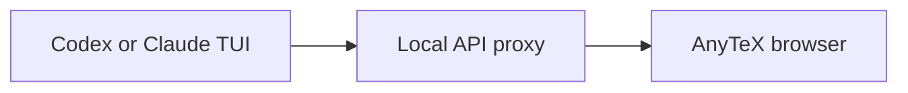

# anytex

`anytex` is a transparent PTY proxy that turns LaTeX printed by an interactive
program into inline terminal images. It is intended for tools such as Codex and
Claude Code, without requiring either tool to know anything about terminal
graphics.

The rendered equations are tightly cropped transparent PNGs. Display uses the
[Kitty graphics protocol](https://sw.kovidgoyal.net/kitty/graphics-protocol/),
which works in both Kitty and Ghostty.

## What works

- Kitty and Ghostty: inline and display equations
- Terminal.app: normal PTY proxying, but no images (Terminal.app has no supported
  inline-image protocol)
- Delimiters: `\(...\)`, `\[...\]`, `$$...$$`, and conservative `$...$`
- Codex-normalized delimiters: standalone `[`/`]` lines and TeX-containing
  parentheses such as `(\mathbf{u})`
- Complete `latex`/`tex` code blocks and document bodies emitted by Claude
- Delimiters split across arbitrary PTY reads
- Full-screen TUI output reconstructed with a VT screen emulator
- ANSI styling, cursor movement, erasing, scrolling, and synchronized repaints
- Window resizing and normal interactive input
- Transparent backgrounds and configurable equation color

## Install

Python 3.10 or newer, `latex`, and `dvipng` are required. Both TeX executables
are included in a normal TeX Live or MacTeX installation.

```sh
python3 -m pip install -e .
anytex --check
```

Run the check from Ghostty or Kitty. It compiles and displays a sample equation,
and also verifies that the generated PNG has an alpha channel.

## Use

Put `anytex` before the program you want to run:

```sh
anytex -- codex
anytex -- claude
anytex -- python -q
```

### Experimental browser companion

Browser mode leaves the main terminal completely unchanged and mirrors the raw
PTY output to a read-only localhost page. xterm.js interprets the VT control
stream without displaying its own terminal. AnyTeX reconstructs user and
assistant messages from that buffer, rejoins terminal-wrapped lines, and renders
each message as Markdown. Headings, lists, tables, fenced code, emphasis, links,
and KaTeX equations therefore share one normal scrollable HTML document:

```sh
anytex --browser -- codex
anytex --browser -- claude
```

For direct `codex` and `claude` commands, browser mode also starts a temporary
loopback API proxy. The child alone receives the per-run routing override:
Codex gets command-line configuration for its Responses base URL, while Claude
Code gets `ANTHROPIC_BASE_URL` through its child environment. The proxy forwards
responses as they arrive and records provider-neutral turn, call, user-message,
and assistant-text events. API user messages and assistant Markdown replace the
corresponding PTY-derived message blocks wholesale, preserving exact Markdown
and TeX while terminal chrome, tool UI, status indicators, and permission panels
continue to come from the PTY. Calls caused by tools remain grouped in their
original turn. If an API record is absent or fails before producing text, the
PTY-derived block remains as the fallback. Use `--no-api-proxy` for PTY-only
behavior or `--api-upstream URL` to override the upstream during development.

Open the token-bearing URL printed at startup. Keyboard input remains in the
main terminal; the browser is deliberately a companion rather than a second
interactive client. Before Claude Code takes over the terminal, AnyTeX pauses
for ten seconds and prints a reminder so there is time to copy or open this URL.
Use a fixed port when helpful for browser automation:

```sh
anytex --browser --browser-port 8765 -- codex
```

Use **Download HTML** in the companion header to save the current transcript as
a static, self-contained snapshot. The export embeds its CSS and KaTeX fonts,
removes the live connection and access token, and records each block's original
Markdown source, terminal row bounds, role, frozen state, and render signature
as `data-*` attributes for later diagnosis. It also embeds the normalized API
event log and reconciliation metadata in a non-executable JSON script block.
Inline code, fenced code blocks, and rendered `latex`/`tex` fences highlight on
hover and copy their original source when clicked. This remains available in
downloaded snapshots, with a local-file clipboard fallback.

Fenced `mermaid` blocks render as diagrams in the live transcript and remain
fully rendered in downloaded HTML snapshots. Click a diagram to copy its
original Mermaid source:



The server binds only to `127.0.0.1`, and its live event stream requires the
random per-run token in the printed URL. Keep that URL private: the browser view
can contain the full terminal conversation. This mode does not send Kitty
graphics escapes, placeholder characters, or any other modified output to the
main terminal.

The browser is a rich transcript, not a pixel-perfect second terminal. AnyTeX
uses Codex's full-width user panels and Claude Code's `❯`/`⏺` markers as message
boundaries; output that does not look like a message remains fixed-width terminal
HTML. The live composer remains visible as terminal UI, while submitted prompts
and responses become Markdown messages. Only the active message is reparsed while
it streams. As soon as the next message boundary appears, the completed message
receives a permanent ID and is detached from the VT buffer; later terminal
repainting, reflow, and input cannot rerender it. Incomplete or invalid math stays
visible as one source block instead of being rendered as broken fragments.
Because this mode observes the terminal, Markdown syntax removed completely by
the child cannot be recovered.

For a dark terminal, the default near-white equation color is appropriate. For
a light terminal, choose a dark color:

```sh
anytex --color 202020 -- codex
```

Useful diagnostics and adjustments:

```sh
anytex --check
anytex --graphics kitty --check       # force the protocol during diagnosis
anytex --verbose -- codex             # show the first and all later TeX errors
anytex --no-dollar -- codex            # avoid interpreting any $...$ as math
anytex --inline-rows 2 --max-rows 16 -- codex
anytex --capture-raw codex.raw -- codex # capture the actual PTY stream for diagnosis
anytex --parser stream -- some-command  # legacy parser for append-only output
```

`--graphics auto` is the default. Detection is deliberately conservative because
sending graphics escapes to an unsupported terminal prints garbage. In an
unrecognized but compatible terminal, use `--graphics kitty`.

## How it works

`anytex` gives the child a genuine controlling pseudo-terminal and forwards
keystrokes, output, signals, exit status, and window size. By default, it replays
the child's VT control language into an in-memory terminal grid. After each
synchronized TUI repaint, anytex locates complete equations in the reconstructed
screen, clears their source cells, and places images at the same row and column
without disturbing the child's cursor. This is necessary for Codex because its
apparently linear response is assembled through many disjoint screen updates.

Synchronized updates are processed as true frame boundaries even when several
frames arrive in one PTY read or a boundary escape is split across reads. Image
placeholder updates, scrolling, source clearing, and placement are inserted into
the same atomic frame, preventing stale overlays from flashing at old coordinates.

A completed fragment is compiled in a temporary directory with shell escape
disabled, converted by `dvipng`, and transmitted as a Kitty virtual image.
U+10EEEE Unicode placeholder cells attach that image to the terminal's text grid.
The placeholders therefore move through scrolling and scrollback with surrounding
text; repainting a cell naturally replaces its image. The older append-only byte
parser remains available as `--parser stream`.

## Delimiter behavior

Single dollars are ambiguous in terminal output. `anytex` will not treat a dollar
followed by whitespace or a digit as an opener, and will not render numeric-only
contents. Thus prices such as `$12.50` remain text. Use `\(42\)` when a numeric-only
inline expression should render, or `--no-dollar` for strictly unambiguous parsing.

Codex can consume the backslashes in math delimiters while rendering Markdown to
the terminal. For that output, anytex also recognizes `[` and `]` when each is on
its own line and the enclosed text contains a TeX command. A parenthesized span is
recognized only when it begins with a TeX command, such as `(\rho)`; ordinary prose
like `(p)` is deliberately left alone.

When Claude emits a complete LaTeX document, anytex treats it as one screen
region. It extracts only the text between `\begin{document}` and
`\end{document}` and renders that body using anytex's own fixed preamble. A fenced
`latex`/`tex` block and Claude's occasional `\document{article}` shorthand are
also recognized. Model-supplied document classes and packages are intentionally
ignored rather than executed.

If compilation fails, the source cells remain visible, so output is never silently
lost. The first error is reported; `--verbose` reports every error.
Raw captures can contain the full child conversation and terminal metadata; review
them before sharing. Existing files are never overwritten.

## Security and limitations

LaTeX comes from an untrusted child process. Rendering uses `-no-shell-escape`,
paranoid TeX file access, a temporary working directory, a timeout, and rejects
file-I/O and macro-construction primitives. This substantially narrows the attack
surface, but TeX is a large interpreter; do not treat this as a hardened sandbox
for hostile multi-tenant input.

Terminal images are cell placements, not font glyphs. Selection and copy/paste
therefore operate on the surrounding terminal text, not the equation pixels.
Full-screen applications can repaint an image's cells at any time. Anytex tracks
the reconstructed grid and restores affected placeholders, but unusual terminal
extensions that `pyte` does not emulate may still cause temporary drift.

Inside tmux, anytex wraps graphics escapes for tmux passthrough. tmux may need
`set -g allow-passthrough on` in `~/.tmux.conf`.

## Development

```sh
PYTHONPATH=src python3 -m unittest discover -s tests -v
PYTHONPATH=src python3 scripts/replay_capture.py /path/to/codex.raw
cd browser-ui && npm install && npm run build
```

The test suite covers chunk boundaries, ANSI sequences, ambiguous dollars,
render-failure fallback, VT screen reconstruction, disjoint synchronized repaints,
transparent render safety, image lifecycle, placement, resizing, and terminal
detection. `anytex --check` is the local TeX integration test. The replay tool runs
captured TUI output through the production overlay without displaying its escapes.
